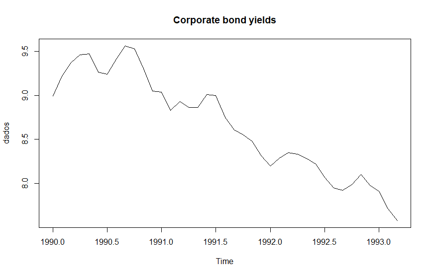
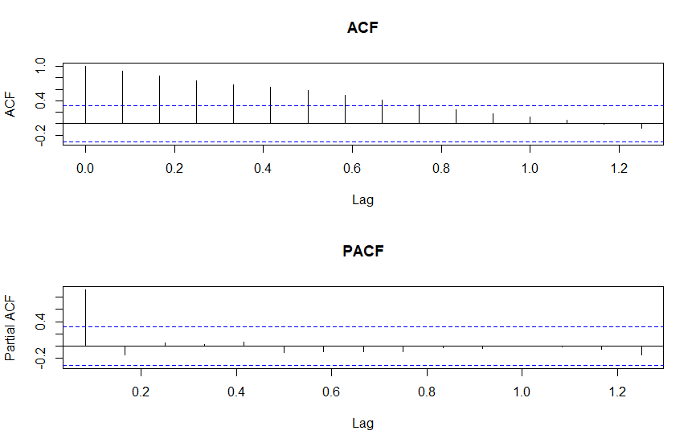
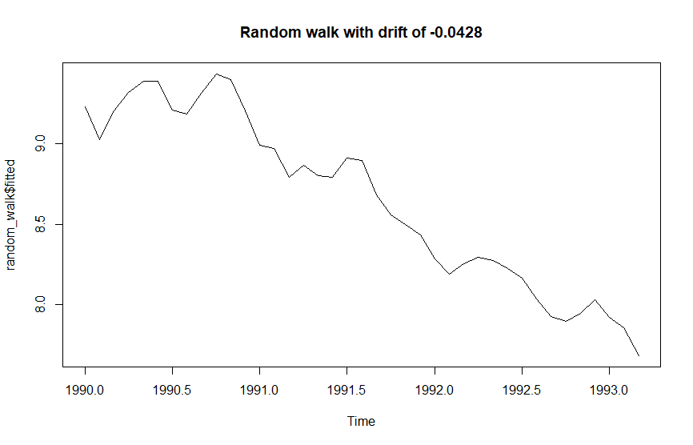

Creating a simple AR model to fit the US monthly corporate bond yields (1990-1994).
 
 

A graph showing the series

 
 

 
 

Supposing the data are stationary, I will observe the correlogram and determine which specification fits best.

 
 

 
 

By observing the ACF/PACF, the behavior of the series is similar to an AR(1).
Since the original series exhibits a downward trend, I include a negative drift in the model.

 
 

An estimate of the model is:

 
 

$Yt = -0.0428 + Yt-1 + ut$

 
 

where -0.0428 is the drift.

 
 

Plotting the AR(1)

 
 

 
 

Then I finally checked whether the residuals are white noise by apllying an ADF Test. It returned a p-value of 0.01, indicating that the residuals are white noise.

 
 

